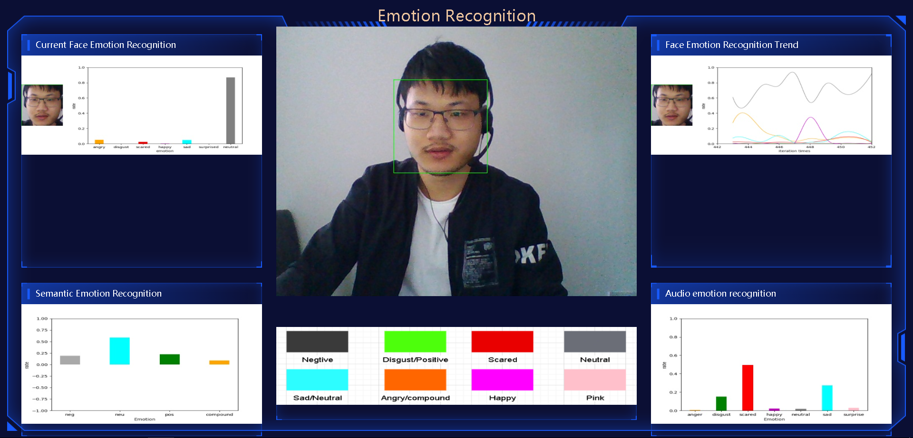
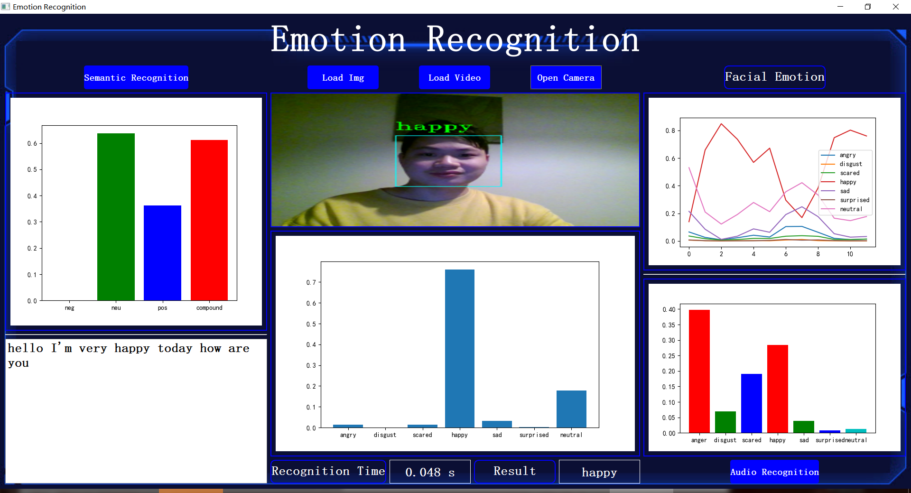

This project is deployed in python environment.

In order to make AI smarter by detecting user emotions, this project analyzes and determines the current type of human emotions through computer vision, semantic recognition and audio feature classification. In facial expression recognition, for the problems of large number of parameters and poor real-time performance of expression recognition methods based on deep learning, we have seen a paper that proposes a face expression recognition method based on multilayer feature fusion with lightweight convolutional networks, which uses an improved inverted residual network as the basic unit to build a lightweight convolutional network model. Based on this method, we optimize the traditional CNN MobileNet model and finally construct a new model framework ms_model_M, which has only about 5% of the number of parameters of the traditional CNN MobileNet model. model_M is 74.35% and 56.67%, respectively, while the accuracy of the traditional MovbliNet model is 74.11% and 56.48% in the tests of these two datasets. This network structure well balances the recognition accuracy and recognition speed of the model. For semantic emotion detection we used existing models and APIs. For audio emotion detection we trian the model using 7 machine learning algrithm, the best results is MLPC achieve 72% accrucy. finally we implemented an emotion recognition system that can determine the user's emotion based on the user's facial expressions, speech and audio of speech.

This project designed 2 version, one is web application, other one is desk application.

The below is our web application interface, there are 4 data visualization charts, 
Its is used to display the probability of current facial emotion, the trend of facial emotion, 
semantic emotion recognition and audio emotion recognition, respectively.and middle is the camera, also
shows what emotions are represented by each color on the bottom.

run this django project in cmd:

1. pip install requirements.txt
2. python manage.py runserver

Below us our desk application interface,
In addition to the features of the web application there are also videos and images that can be added to predict emotions.

run this project in cmd:

1. pip install requirements.txt
2. python main.py

